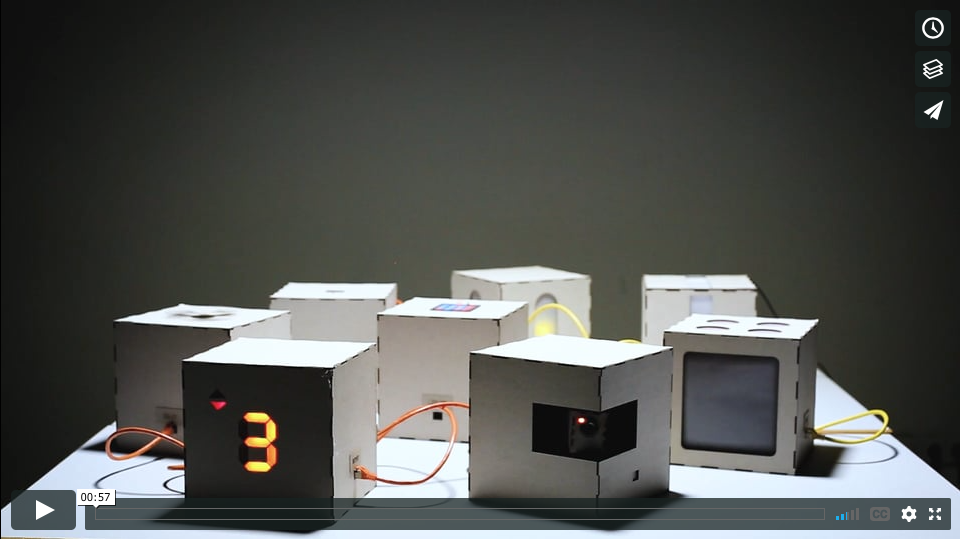
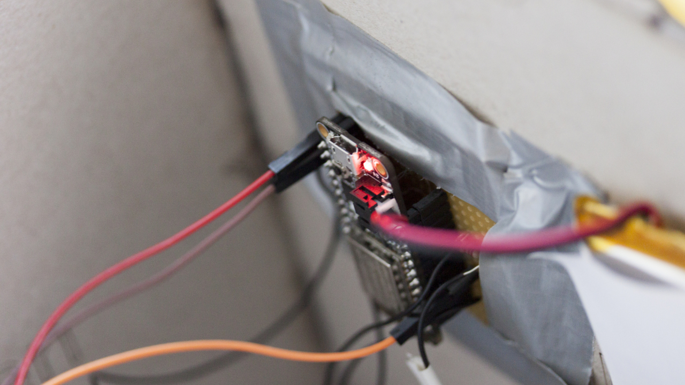
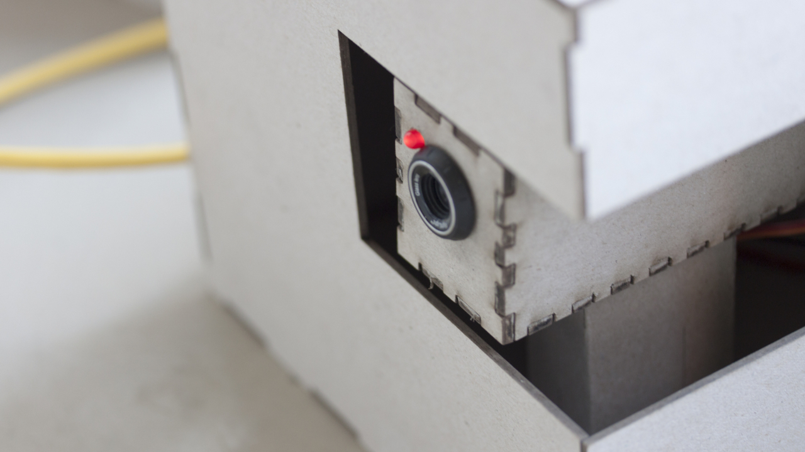
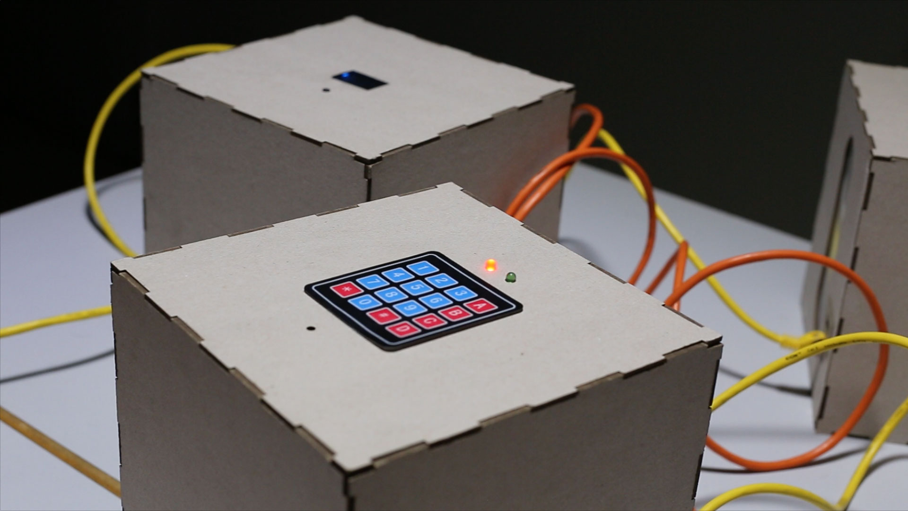
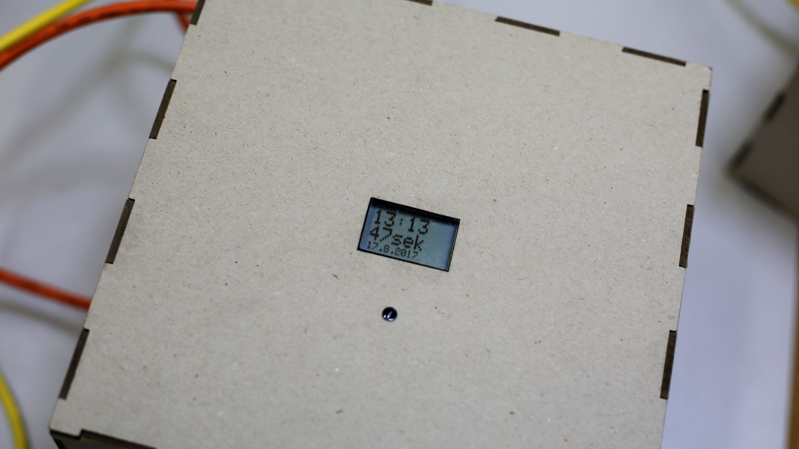
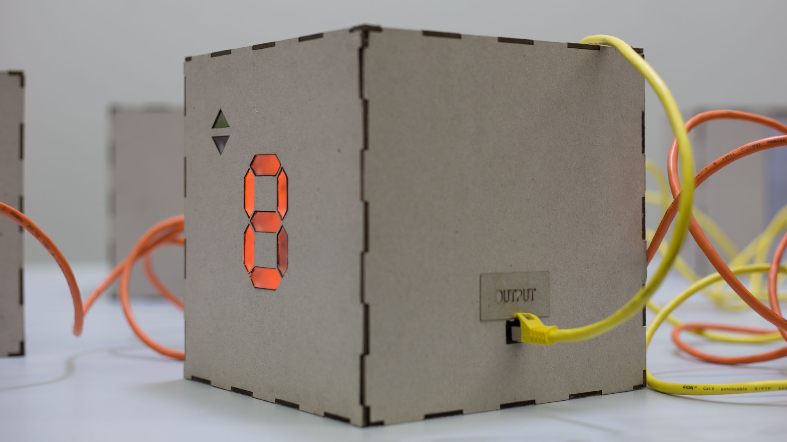
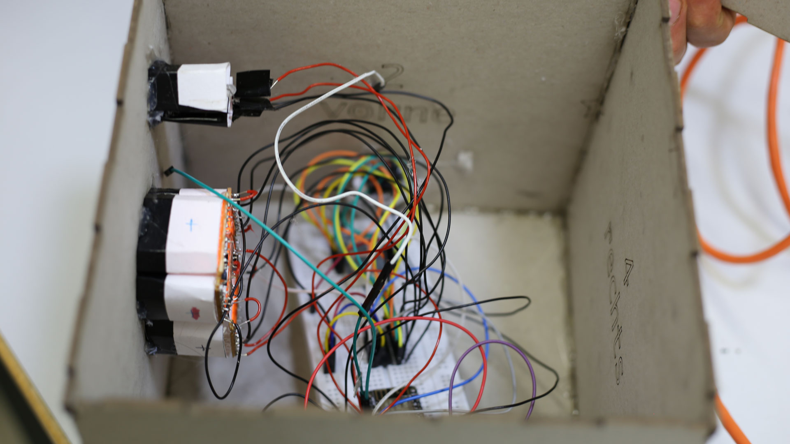
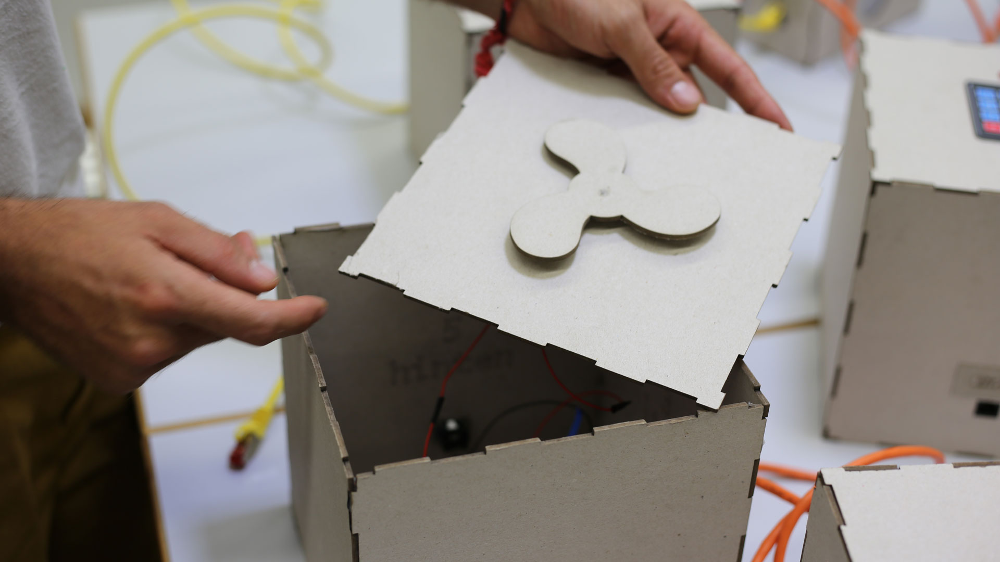
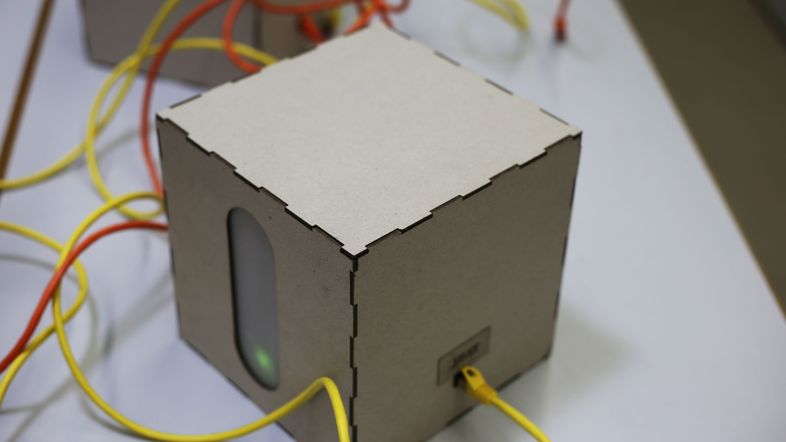
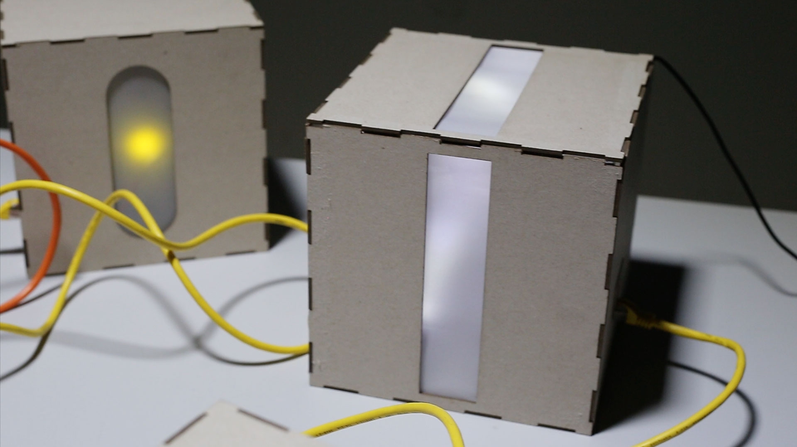

# Box-Net

Our interactive installation "Boxnet" is a decentralized and expandable network of boxes and illustrates the connectivity of everyday devices.

[Watch the trailer on Vimeo](https://vimeo.com/230505896)

## Concept

As the everyday life is increasingly digitalized and a rising amount of devices are connected to the Internet of Things (IoT), security issues potentially become more crucial than ever before. Hence we considered in an early version of our concept a virus, that spreads in the network and flaws the boxes functionality. The original mode could only have been restored by pressing a physical patch button on the box. Users would connect as much boxes as possible while keeping the network uninfected. Due to the complexity of our system we decided to go for simplicity and focus on the interaction between the boxes.

## Specification

We designed two box types:

- ***Write Boxes*** have two Output ports. Up to two boxes can be connected directly to receive signals. These signals are based on the individual configuration of the *Write Box*.
- ***Read Boxes*** are able to receive signals from their Input port. The box can perform an individual action triggered by an input signal. During or after this action the received signal will be passed through the box via its Output ethernet port. Hence a *Read Box* is not able to generate their own impulse, but activates other connected boxes. In this way boxes can be connected in a row while being fed by only one *Write Box*.

### Hardware & Construction

Each group member contributed two unique boxes to our Boxnet network. We standardized the hardware basics and box form factor to ensure a consistent impression and hassle-free connectivity.

- Adafruit Feather HUZZAH ESP8266
- 3.7 V Lithium Polymer battery
- 3.3 V voltage (GPIO pin default)
- 20x20x20mm box measurements
- Soldered Ethernet ports

We laser cut the boxes out of binder's board. The templates can be found in the [construction folder](box_construction).

### XNodes library
The communication within the Boxnet network is running on the [XNodes library](https://github.com/FH-Potsdam/XNodes) from Fabian Morón Zirfas.  

## Boxes

**Write Boxes**
- Surveillance camera
- Security gate
- Clock

**Read Boxes**
- Elevator
- Ventilator
- Traffic lights
- Lamp
- Stove

***

### Surveillance camera

This box by Nina Botthof represents a security system. Surveillance cameras in particular are known to be very vulnerable to bot attacks. Inside the box there is a camera dummy with a built in motor and LED. The camera pivots in regular intervals from left to right and back. The LED is blinking simultaneously. It can initiate a signal and is switched on from the beginning.

##### Construction

On one edge of the box is a cut-out window. The camera is located inside the box and points out of the window. The camera is, like the box, constructed out of cardboard. To give a more realistic impression, there is a lens from an old web cam and a red LED on the front. It also has a rack to hold the camera in position. A motor is mounted inside the rack, right under the camera, to control the camera’s movement.

##### Code

One main challenge of this box was to switch the LED on and off and move the motor  simultaneously. Normally only one action can be executed at a time. To solve this problem `TimedAction.h` has been used. It helps coordinating multiple actions by defining intervals.

[Open the source code of this box](hardware_code/Write_boxes/Camera_nina)

***

### Security gate

This box by Paul Roeder is a security gate connected to the internet. As soon as the password is entered correctly, this Write box will output a signal.

##### Construction

On the upper surface of the box is a 4x4 keypad, a green and red LED and a hole to the build-in piezo buzzer. Since the keypad requires more pins than their are available on the board, I used a PCF8574 port expander.

##### Code

The code tracks the pressed keys and adds them to a string variable which deletes itself if its length exceeds more than four characters. If the string equals the valid password "1234", the red light switches of and the green LED will be turned on for a few seconds. Also their is a sound feedback coming from the piezo.

[Open the source code of this box](hardware_code/Write_boxes/SecurityGate_paul)

***

### Clock

This Write box by Paul Roeder stands for a digital clock and displays the current time and date on a LCD display. Every ten seconds it outputs a signal.

##### Construction

The Nokia 5110 LCD is sticked behind acrylic glass and sets its background light level based on the amount of light to safe energy.

##### Code

The box connects to the internet using its built-in Wi-Fi module to request the current time from a time server. The Arduino library "Time.h" ensures that the seconds are strictly in time. Also two libraries from Adafruit are integrated to power the LCD display. The LCD background light is set by pulse-width modulation (PWM), mapped from a photo resistor value.

[Open the source code of this box](hardware_code/Write_boxes/DigitalClock_paul)

***

### Elevator

The Box built by Daniel Boubet represents an elevator floor  counter, which counts from the E (Erdgeschoss) to 9 and backwards. The counter will be activated as soon receives an input signal from another box. Every time the Counter makes a cycle, the Box will send a Signal.

##### Construction

The counter is built based on a 7 segment counter. Rows of orange leds connected in parallel are placed behind an Acrylglas surface which has been accurately lasercutted and fitted into the cardboard. Every row of leds its separated about 2,5mm from the Acrylglas, in this way the leds will blur. To have a better backlight reflection the rows has been encapsulated in reflecting paper around.

The Code uses the <Ticker.h> library that allows a count from 0 to 9. A shift register was necessary in order to get more Outputs from the board to control several rows of leds.

[Open the source code of this box](hardware_code/Read_boxes/Elevator_daniel)

***

### Ventilator

This Read Box box was built to simulate a normal household ventilator.

##### Construction
The ventilator has been laser cutted on cardboard and it's driven by a 3v taken from a servomotor.

##### Code
The code makes the ventilator run for 10 seconds every time that receives an input signal. The ventilator will send as well a signal every circle.

[Open the source code of this box](hardware_code/Write_boxes/Ventilator_daniel)

***

### Traffic lights

Sujing Lin designed this traffic lights box. As the box receives a signal from any connected box, the lights switches from red, orange to green and back.

[Open the source code of this box](hardware_code/Read_boxes/TrafficLights_sujing)

***

### Lamp

This box by Sujing Lin is a Lamp which can be controlled by incoming signals like an IoT Lamp. In the inside the box is separated into four quarters to shine into multiple directions. The lightning is provided by a bunch of LEDs.

[Open the source code of this box](hardware_code/Read_boxes/Lamp_sujing)

***

### Stove Box

This box by Nina Botthof represents an oven and is especially vulnerable as an infection could lead to fires and serious injuries. The first concept featured a dummy fire made out of acrylic glass which appears when the box is infected. Due to the mechanical complexity this function has been dropped.

The stove box can only receive signals and pass them through. Whenever it has an input, the cooktop lights up and fades out slowly. The received signal is passed through when the action is finished.

##### Construction

On the upper side of the box are four holes cut out for the cooktop which has been simulated with four LEDs per hotplate. To get closer to the real look of a cooktop, the LEDs are covered with a translucent paper with a radial dot pattern printed onto it. This gives a good visual impression of an oven. Additionally, there is a funnel made out of red paper to amplify the intensity of the LEDs. The frontside of the box is also cut out in a rectangular shape for the oven. Due to the restriction of only 3.3 V, there are no LEDs and no functionality added to this feature. It has been kept in to maintain the look of an ordinary kitchen stove. Therefore there is only another sheet of translucent paper to cover up the hole.

##### Code

A major problem with this box was the fading of the LEDs. The use of a shift registry was discarded, because this made fading very difficult. Thus the final implementation has been made with a reduced number of LEDs connected in parallel. Then the fading was accomplished by using pulse-width modulation.

[Open the source code of this box](hardware_code/Read_boxes/Stove_nina)
