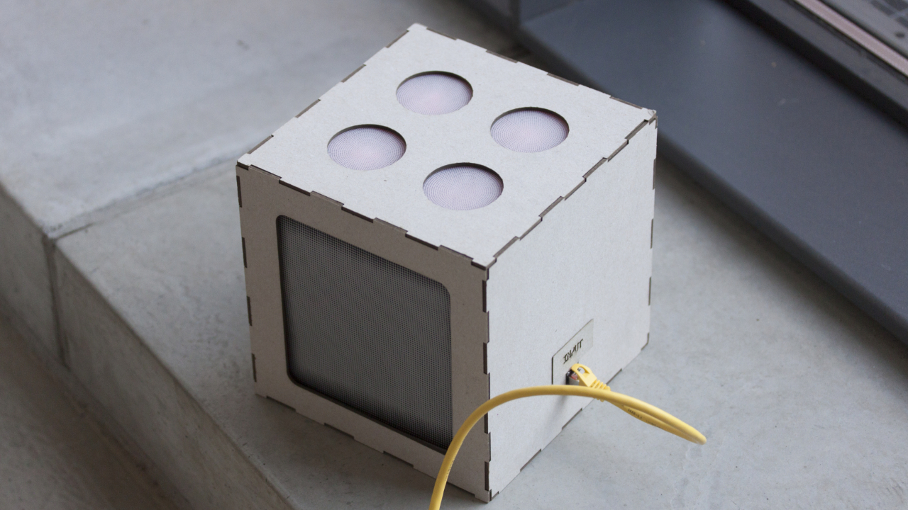
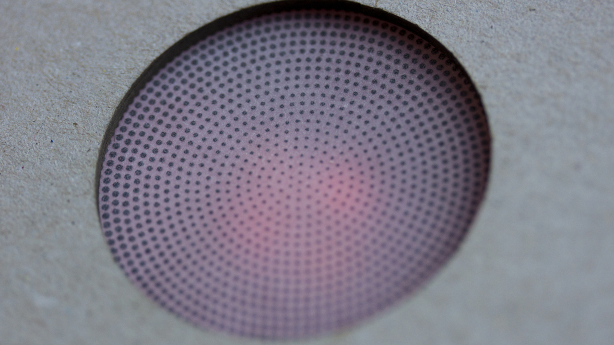

## Initial Concept

The first draft of the project was a game, which explains the dangers of bot networks invading connected IoT devices. As the everyday life becomes more technical and every device is connected to the internet, security issues are more harmful than ever before. The game Box-Net wants to illustrate the perils of bots being passed from one device to another and the damage they bring about.  
Box-Net consists of multiple small boxes, each representing one IoT device in a network. These boxes can be plugged together to illustrate the interconnectivity of such devices. But there are viruses that can be passed through and flaw the boxes functionality. The functionality of the boxes can only be restored by keeping the firmware up to date via a patch button. The goal is to connect as much boxes as possible while keeping them uninfected.


## Revised Concept

Due to time shortage the initial concept had to be revised in order to be finished on Werkschau.  
The idea of Box-Net was cut down to the essentials: an interconnected system. It still features the boxes, each representing one device e. g. a lamp. The boxes can be connected to each other and react on a signal that is being passed through. This way the players can explore the different combinations an how the boxes react.  
To keep the network as simple as possible there are only two classes: sending and receiving boxes. The sending boxes are always switched on and output a signal, they can not receive any signals. Receiving boxes on the other hand can only react to incoming signals and only execute an action when they have input.  


## Construction

For the hardware compound of the boxes the Adafruit Feather Huzzah has been used. Main factor for that decision was the built in lithium-ion battery plug.  
The outer construction of the boxes was made out of a strong cardboard. It is lightweight compared to MDF or acrylic glass and additionally cheaper than any other comparable material.  


## Boxes

### Surveillance Box

This box represents a security system. Surveillance cameras in particular are known to be very vulnerable to bot attacks.  
Inside the box there is a camera dummy with a built in motor and LED.

In the initial concept there where two kinds of funktionallity: normal and infected. 


#### Normal

The camera pivots in regular intervals from left to right and back. The LED is blinking simultaneously. It can initiate a signal and is switched on from the beginning.

#### Infected

The camera and the LED act unpredictably and irregularly.


#### Implementation

##### Construction

On one edge of the box is a cut-out window. The camera is located inside the box and points out of the window.  
The camera is, like the box, constructed out of cardboard. To give a more realistic impression, there is a lens from an old web cam and a red LED on the front. It also has a rack to hold the camera in position. A motor is mounted inside the rack, right under the camera, to control the camera’s movement.


##### Code

One main issue of this box was to switch the LED on and off and move the motor  simultaneously. Normally only one action can be executed at a time. To solve this problem `TimedAction.h` has been used. It helps coordinating multiple actions by defining intervals.


```c
#include <XNode.h>
#include <TimedAction.h>
#include <Servo.h>


//GLOBALS
const int servoPin = 0; // Pin für die steuerung des Servos
bool increment = true; // true, wenn Winkel des Servos erhöht werden soll
short pos = 0; // aktueller Winkel des Servos
const int ledPin = 12; // Pin für die LED
int ledState = LOW; // LED standardmäßig ausgeschalted
int randomAngle = random(90);
int LEDrandom = random(100);
bool virus = false;

int i = 0;

int output_pin = 14;
int output_virus_pin = 2;
int input_pin = 4;
int input_virus_pin = 5;

XNode node(input_pin, output_pin, input_virus_pin, output_virus_pin);
Servo myservo;

//FUNCTIONS

// schaltet LED ein/aus
void ledBlink() {
  // ist LED ein oder aus – kehrt wert um
  if (ledState == LOW) {
    ledState = HIGH;
  } else {
    ledState = LOW;
  }

  // Versetzt LED in den aktuellen Status
  digitalWrite(ledPin, ledState);
}

//timers – müssen NACH den Funktionen kommen
TimedAction ledThread = TimedAction(500, ledBlink);

void setup() {
  pinMode(ledPin, OUTPUT); // deklariert ledpin als output
  Serial.begin(115200); // definiert datenfrequetz – nur für Serial Monitor
  node.init();

  node.setInterval(50);
}

void loop() {

  if (/*node.virusDetect()*/ virus == true) {
    myservo.attach(0); // Servo wird aktiviert
    myservo.write(randomAngle);
    delay(30);
    randomAngle = random(90);
    LEDrandom = random(100);

    if (LEDrandom < 50) {
      digitalWrite(ledPin, LOW);
    }

    else {
      digitalWrite(ledPin, HIGH);
    }

  }
  else {
   
    ledThread.check();

    myservo.attach(0); // Servo wird aktiviert

    for (pos = 0; pos <= 90; pos++) { // geht von 0 bis 90 Grad durch

      // prüften wann aktionen durchgeführt werden sollen, auch wärend der Schleife
      ledThread.check();

      myservo.write(pos); // Servo nimmt position aus Variable 'pos' ein
      Serial.println(pos);
      delay(15); // pause damit Servo Zeit hat die Position einzunehmen

      if (pos == 90) {
        node.send();
        Serial.println("senden");
      }
      
    }

    myservo.detach(); //deaktiviert Servo – braucht weniger Strom
    digitalWrite(0, LOW);

    for (i = 0; i <= 5000; i++) {
      ledThread.check();
      delay(1);
    }

    myservo.attach(0); // Servo wird aktiviert


    for (pos = 90; pos >= 0; pos--) { // geht von 0 bis 90 Grad durch
      // prüften wann Aktionen durchgeführt werden sollen, auch während der Schleife

      ledThread.check();

    myservo.write(pos); // Servo nimmt position aus Variable 'pos' ein
      Serial.println(pos);
      delay(15); // Pause damit Servo Zeit hat die Position einzunehmen
      
    }
    myservo.detach(); //deaktiviert Servo – braucht weniger Strom
    digitalWrite(0, LOW);

    for (i = 0; i <= 5000; i++) {
      ledThread.check();
      delay(1);
    }

  }
}
```


### Stove Box

This box represents an oven and is especially vulnerable as an infection could lead to fires and serious injuries. The first concept featured a dummy fire made out of acrylic glass which appears when the box is infected. Due to the mechanical complexity this function has been dropped.



#### Normal

The stove box can only receive signals and pass them through. Whenever it has an input, the cooktop lights up and fades out slowly. The received signal is passed through when the action is finished.



#### Infected

The cooktop lights up asynchronously and at irregular intervals.


#### Implementation

##### Construction

On the upper side of the box are four holes cut out for the cooktop which has been simulated with four LEDs per hotplate. To get closer to the real look of a cooktop, the LEDs are covered with a translucent paper with a radial dot pattern printed onto it. This gives a good visual impression of an oven. Additionally, there is a funnel made out of red paper to amplify the intensity of the LEDs. The frontside of the box is also cut out in a rectangular shape for the oven. Due to the restriction of only 3.3 V, there are no LEDs and no functionality added to this feature. It has been kept in to maintain the look of an ordinary kitchen stove. Therefore there is only another sheet of translucent paper to cover up the hole.

##### Code

A major problem with this box was the fading of the LEDs. The use of a shift registry was discarded, because this made fading very difficult. Thus the final implementation has been made with a reduced number of LEDs connected in parallel. Then the fading was accomplished by using pulse-width modulation.


```c
#include <XNode.h>

int ledPinOne = 14;// was anderes nehemen! LED connected to digital pin 9
int ledPinTwo = 15;
int output_pin = 0;
int output_virus_pin = 2;
int input_pin = 4;
int input_virus_pin = 5;
XNode node(input_pin, output_pin, input_virus_pin, output_virus_pin);

boolean action = false;

void setup () {
  node.init();
  pinMode(ledPinOne, OUTPUT);
  pinMode(ledPinTwo, OUTPUT);
  Serial.begin(115200);
}

void loop() {
  
Serial.println(node.listen());
  if(node.listen() == true && action == false){
    action = true;
    Serial.println(action);
  }

  if(action == true){
    
    // fade in from min to max in increments of 5 points:
    for (int fadeValue = 0 ; fadeValue <= 1023; fadeValue += 20) {
      // sets the value (range from 0 to 255):
      analogWrite(ledPinOne, fadeValue);
      analogWrite(ledPinTwo, fadeValue);
      // wait for 30 milliseconds to see the dimming effect
      delay(30);
    }

    // fade out from max to min in increments of 5 points:
    for (int fadeValue = 1023 ; fadeValue >= 0; fadeValue -= 20) {
      // sets the value (range from 0 to 255):
      analogWrite(ledPinOne, fadeValue);
      analogWrite(ledPinTwo, fadeValue);
      // wait for 30 milliseconds to see the dimming effect
      delay(30);
    }
    node.send();
    action = false; // action wird nach dem Fading zurückgesetzt
    Serial.println(action);
  }
  
}
```

