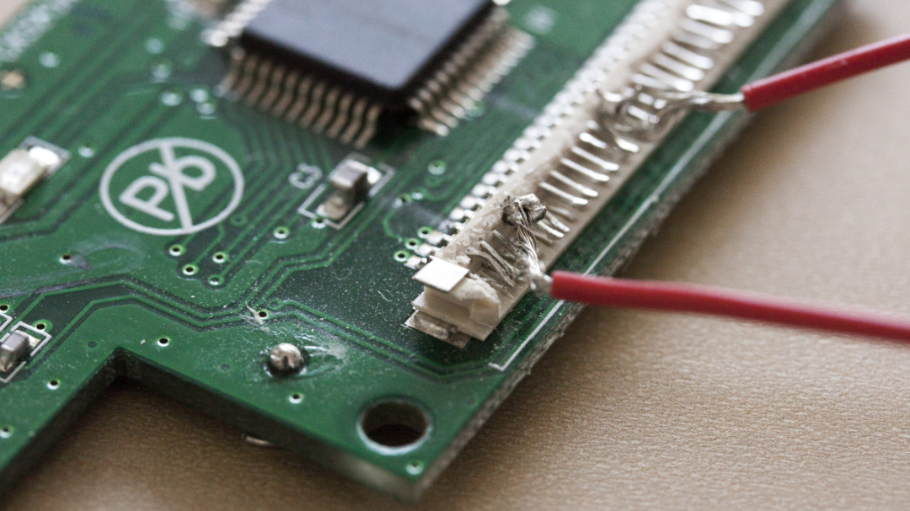
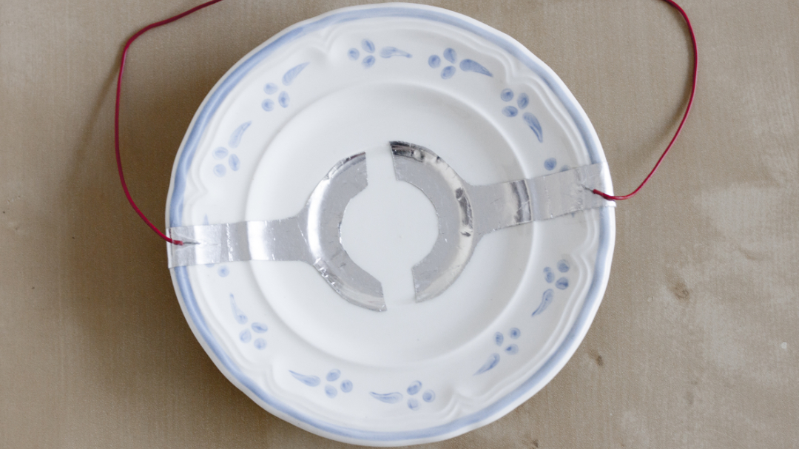
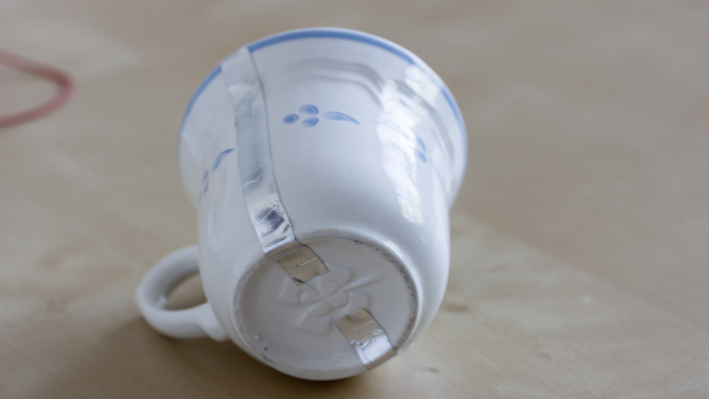
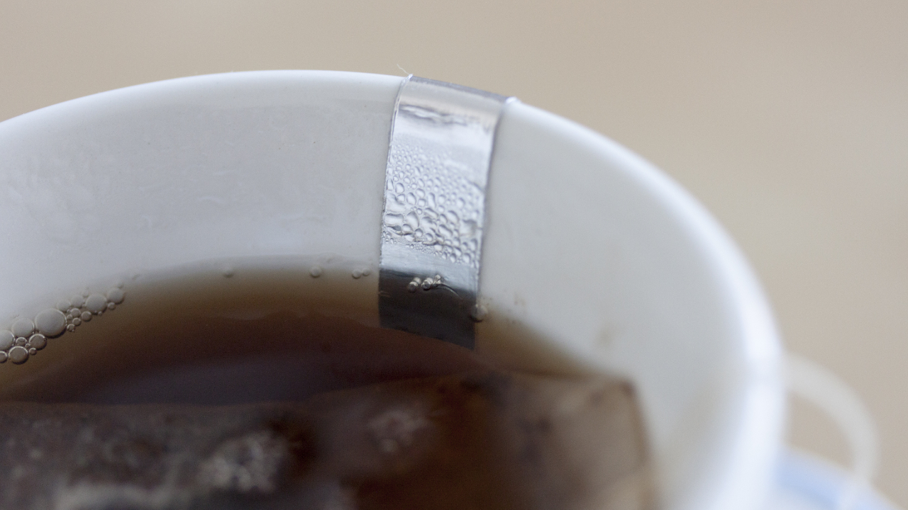
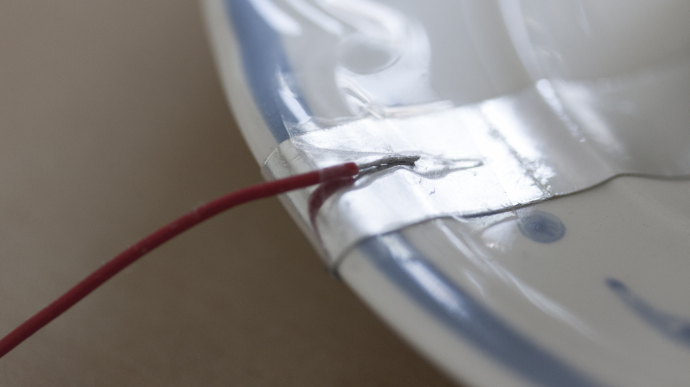
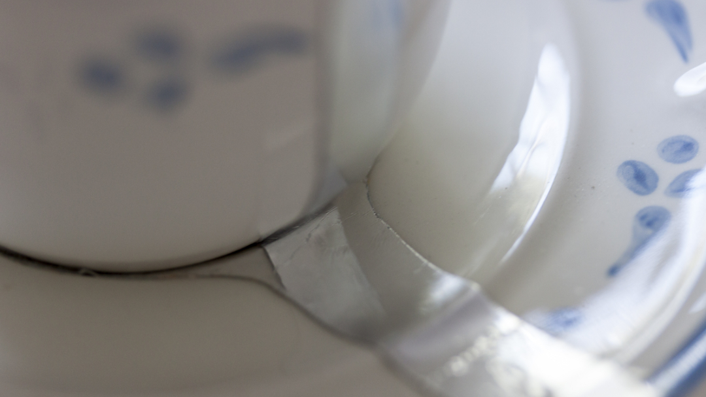
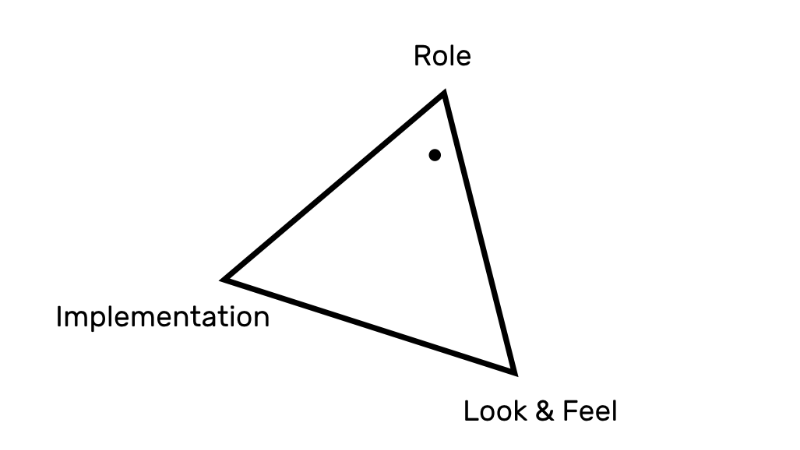

## Assignment

###### 

The task of this prototype was to give a physical representation to a digital action. This had to be achieved by a HID-Hack — the disassembling and repurposing of a human interface device e. g. a keyboard. In order to evaluate the prototype, user tests with at least five participants had to be carried out.


## Idea: Alfredo


The Idea behind Alfredo is the automation of one’s daily morning routine. The aim was to create a cup, that does not only set a timer by itself, but helps to get off to work on time and to choose the appropriate clothing for the weather outside.
As soon as water is poured into the cup, it sets a timer for a predetermined time. When the time is over, an iMessage is sent to one’s Phone. Additionally, Alfredo activates a certain playlist in iTunes to provide a relaxing atmosphere. While the timer is running Alfredo suggests articles from news sites to read during the brewing time. A special feature is that the articles are filtered by reading time, so one can finish reading the article until the tea is ready.
Furthermore, Alfredo informs about the traveling time to one’s appointed working place and sends a notification when one should leave. To round up the experience, it also gives information about the current weather by opening the weather app.
Summarising this Alfredo is a collection of timed actions triggered by the tea being brewed. These actions can be configured according to one’s habits. If the idea of Alfredo was developed further, it would include the cup, but also a service which is provided by an app to download on your phone.


## Implementation


### HID-Hack

To build the electronic part of the cup a keyboard has been disassembled. To address certain keys from the keyboard, two contacts need to be connected and close the circuit. Therefore wires have been soldered to these contacts.




To create a connection between the contacts whenever water is poored into the cup, it also needs conducting material. Two stripes of aluminium foil are sticked to the saucer and to the cup. These stripes need to reach into the cup so conductivity of the water connects the material and closes the circuit. The wires from the Keyboard are mounted onto each stripe on the saucer. 










An advantage of that construction is that the cuircuit is disconnected as soon as the cup is lifted. There is no current inside the cup while drinking.




### Code & Software

For the actions a software called Keyboard Maestro is used. With this software it is possible to map macros to a certain key. In this case when the key + is pressed a macro group consisting of several Apple scrips for the notifications and pauses for the timing is initiated.  
Code as listed below:

```apple script
tell application "Messages"

	set theBuddy to buddy "+491638343320" of service id "BE20AFC9-6AC7-4569-A877-A1252B7DD5F5"
-- message below
	send "Guten Morgen! Dein Timer ist gesetzt. Hier sind ein paar interessante Arikel für die Wartezeit: medium://open/" to theBuddy

end tell
```


## Usertesting

To evaluate the outcome some user testing with five participants had to be done. A qualitative research method was chosen to detect the main strengths and weaknesses of this prototype. The participants have been invited to an open discussion with a demonstration of the prototype. To lead the discussion some questions have been predefined which should be the start of an open debate.


### Questions

- Would you buy this product?
- How did the product simplify, enhance your daily routine?
- Did you have any problems with handling the product?
- Which properties do you like about the product?
- Is there anything you disliked about it?


### Results

The results of the user testing are positive overall.
Four of the five participants claimed that they would buy Alfredo and use it in their daily lives. One mayor argument for the use of Alfredo was the fact that it takes over some tasks which one does not need to think of anymore.  
The participants also pointed out that the possibility to personalise the actions is most important for the project. Every person has their own morning routine and this should not be dictated by the service. Therefore it would be necessary to create a simple user interface for the phone to adjust the timing and change settings easily.
Another participant mentioned that another timer for the perfect drinking temerature could be added to enhance the userexperience.  
Some also pointed out that they would prefer deticated notifications over iMessages.

Some worries have been mentioned concerning the wires and the laptop being close to liquids. Others have not felt secure due to the combination of electricity and water — one said that she was scared to drink because of the current. Gladly this is not a problem because of the construction of the cup. To avoid worries about safety the design should be reworked so one can not see any wires and foil. Minor criticism has been mentioned about the cup size being to small for tea. 


## Conclusion

This prototype represents the role of Alfredo in our daily lives. Implementation and look are not redefined enough yet to suit the customers needs. Therefore the classification in Houde’s & Hills’ system would look as followed:



After all this prototype gives a good impression of the function of the product. It shows most of the features very close to a planned implementation. 