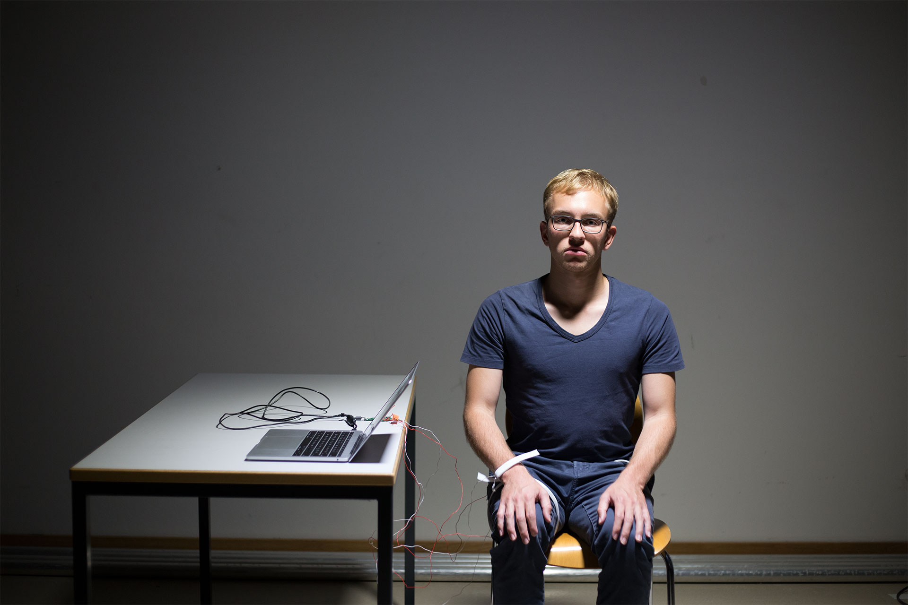
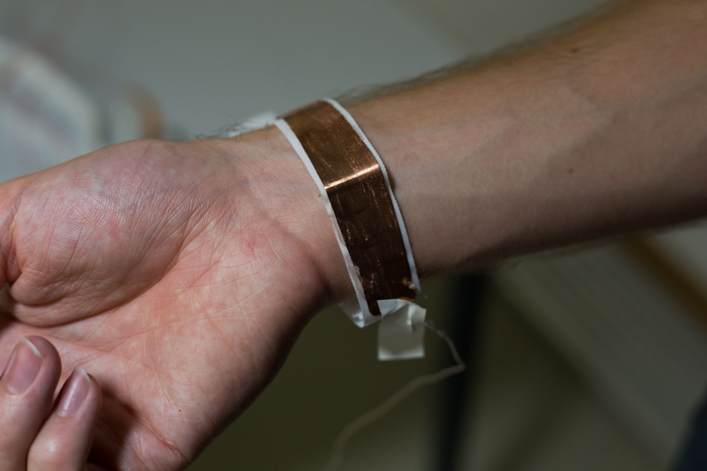
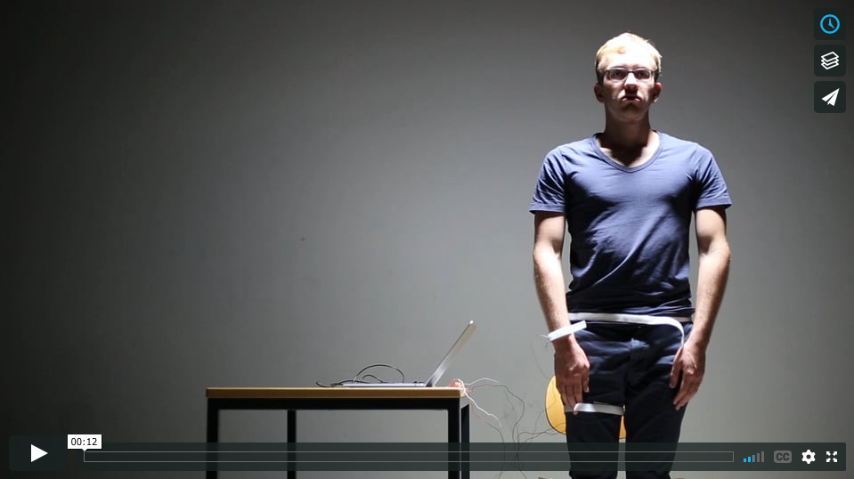

<!-- 
 -->
As I begun this keyboard hacking project I read Martin Fords book ["Rise of the Robots: Technology and the Threat of a Jobless Future"](https://www.amazon.de/Rise-Robots-Technology-Threat-Jobless/dp/0465097537) in which he points up how the role of labour will dramatically change in the near future. All jobs that can be automated by machines, will be automated eventually.

Until the remaining jobs are replaced by machines, human workers will have to compete against them. Their workplaces are increasingly optimized, automatized and standardized. This inspired me to experiment on how humans feel when computers interfere into their job on a extremely personal level.

## Digital slave

My critical concept envisions a scenario of a digitally augmented worker who is doing a very monotonous task. However as he behaves like a human, the connected computer reinterprets his natural body language and outputs artificial voice on their behalf.

I created zipper ribbons that can be bind on the workers arms, hips and buttocks. The ribbons are adjustable to any body shapes and can easily be buckled on other people. I sticked copper plates on the ribbons and soldered circuits using five meters of bell wire. As the user connects these copper contacts, a circuit will be closed. At the end all wires are soldered onto a hacked keyboard driver chip, which sends keystrokes via USB.

The software ["Keyboard Maestro"](https://www.keyboardmaestro.com/main/) on my computer detects inputs from this particular Human Interface Device (HID) and runs macro scripts based on these inputs. In this way I could roughly map the ribbons to a text-to-speech voice output:

## Voice outputs

[Watch the demo on Vimeo](https://vimeo.com/230607138?autoplay=1)

I designed two scenarios of typical human-like action during work. I chose these interactions because they are very sensitive and related to the subjects mood.

### "I'm happy to serve you"

When the subject of my prototype stops using their hands to work on some object or assembly line, a natural gesture is to let the hands fall next to the hip. If the subject would do this, the contact on the ribbon of his right arm gets connected to the one on his hip. This triggers the voice output "I'm happy to serve you" to remind the worker to keep working.

### "I'm not tired yet"

A contact which is sticked on a chair triggers "I'm not tired yet" when the subject sits down. For this purpose a third ribbon is bind on the upper leg with a contact on the back side. This voice output is supposed to extend workers endurance by self-manipulation.  

## User test

The feedback of the user testing I conducted was that people where interested into the concept and it was thought-provoking, however they didn't identify themselves with the artificial voice, although I am unsure if this is really necessary. It would be interesting to experiment with the system in real-life workplaces in order to test their impact on the workers performance.
