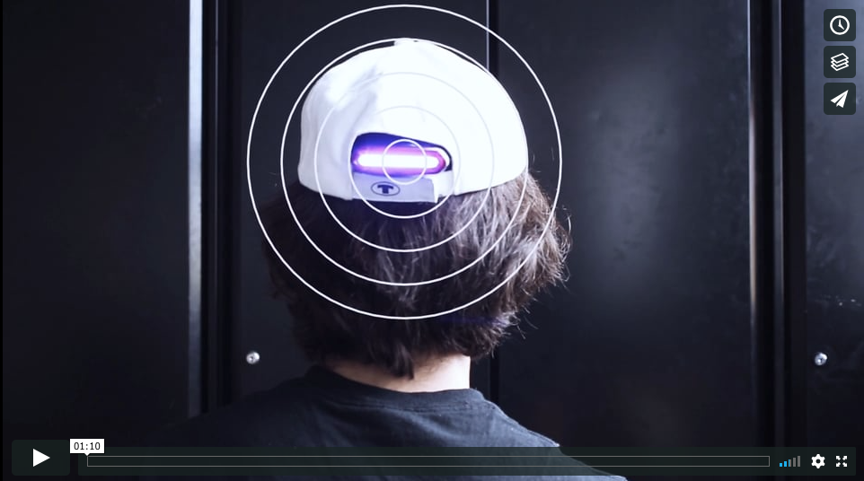

# Brainlink Research Lab

## Introduction

The seminar "Prototyping Machines" of Fabian Morón Zirfas was dedicated to learn and experiment with a variety of common prototyping techniques to enhance our capabilities of visualizing, testing and iterating ideas and concepts.

As the technological complexity increases, it becomes even harder to design high-fidelity prototypes. Both time and budget often restrict realistic implementations. Therefore it can be useful to "fake" prototypes by by-passing an actual implementation: Video prototypes enable us to create our own reality instead of building a working product. Common tools like Adobe After Effects, stop motion animations and further editing techniques can lead to great results.

After a kick-off workshop on After Effect we were well prepared to create our own videos. To avoid that we won't stuck in the ideation process and rather focus on the technical aspect of the video, we drew lots containing inspiring terms.

## The irascible iron

Daniel Boubet and Paul Roeder collaborated to prototype a "irascible iron". Since this negatively connoted adjective usually would not be a typical attribute of a commercial product, we tried to think of a way how the iron might be "hot-tempered" on a meaningful way.

For this reason we envisioned the story around the fictional "FHP Brainlink Research Group", working on a novel brain interface technology that enables research subjects to control objects just by using there mind. In this way even domestic appliances can be controlled.

As our video-prototype tries to prove: The technology works well and the required hardware is minimal (just a blinking head). The video shows a guy precisely ironing a shirt. However, since the object does exactly what the subject feels, there is a major unsolved problem: As the subject gets angry and doesn't want to iron anymore, the iron won't iron as well. The reason is a lack of "emotional stability", a feature which is not yet considered by the technology.

In this way we had an irascible iron.

## Prototyping techniques

To create a plausible and entertaining video, we made use of some video techniques:

### Motion tracking

To introduce the researcher we animated a chyron which moves with the speakers face by motion-tracking the nose and mapping it to the text position.

### Stop motion

The rotating box is controlled by the subjects mind and moves around. We manually took a bunch of pictures while we were moving it step by step. We imported the files as a picture sequence to After Effects and rendered a video scene out of it.

### Look and feel

To create an authentic look and feel of the video, we found the interface lab in our university the right place for our scenario. Furthermore we hang up some prints of scientific visuals. We filmed the story as an interview, since this is a common format to present research results.
